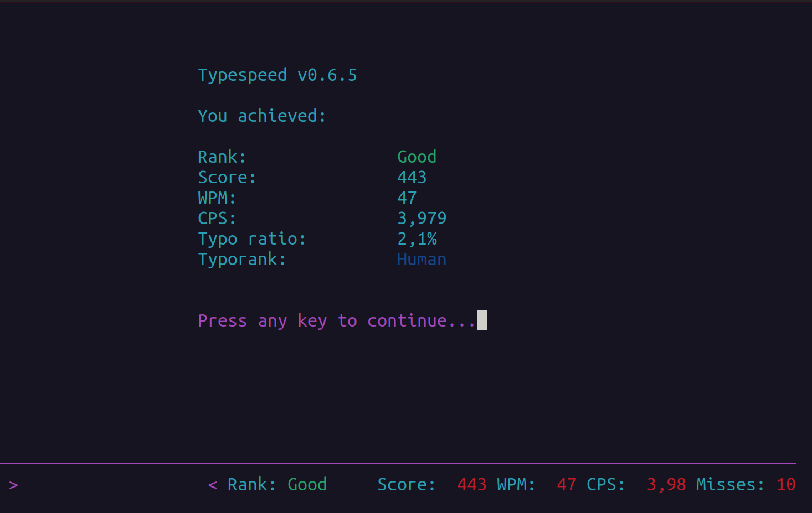

# Exibição da pontuação

Nesta tela aparecerá o resultado de seu teste:

- **Rank:** Classificação
- **Score:** Pontuação
- **WPM:** Palavras por minuto (*Word per minute*)
- **CPS:** Caracteres por segundo (*Characters per second*)
- **Type ratio:** Taxa de erro de digitação
- **Typeporank:** Classificação quanto aos erros de digitação

Por gentileza, anote:

- Score
- WPM
- CPS
- Typo ratio

e preencha o formulário [Envio de dados do teste](../../envio-dados.md).

Além de preencher o formulário, pressione qualquer tecla (Ex.: <kbd>Enter</kbd>) e você verá a [tela de identificação do competidor](identificacao-competidor.md).

