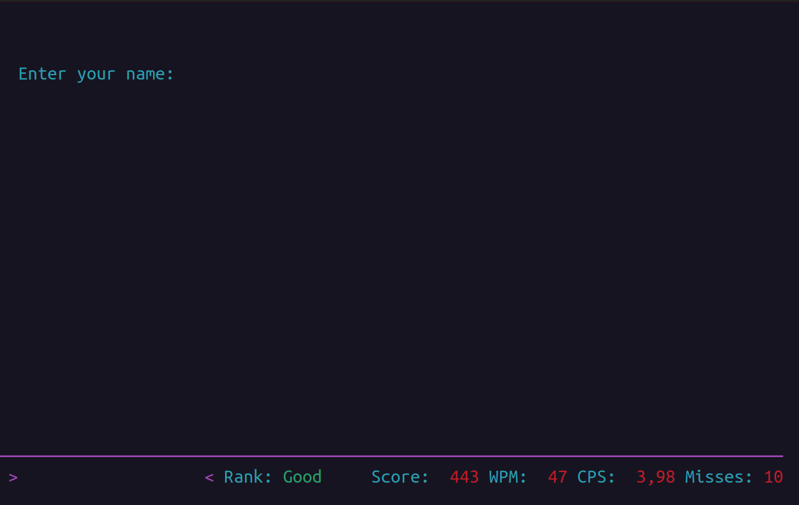

# Identificação do competidor

Nesta tela você deverá se identificar. Por gentileza, coloque: *<Nome> <Sobrenome> (<Matrícula>)*[^1], onde:

- `Nome` é seu primeiro nome;
- `Sobrenome` é um sobrenome a sua escolha;
- `Matrícula` é sua matrícula no IFRN.

Veja o exemplo da {ref}`id:fulano`.

Concluída sua identificação, você verá a [tela de exibição das maiores pontuações](exibicao-maiores-pontuacoes.md).

(id:fulano)=

## Identificação do competidor Fulano

[^1]: Lembre-se de remover os colchetes angulares (`<` e `>`)