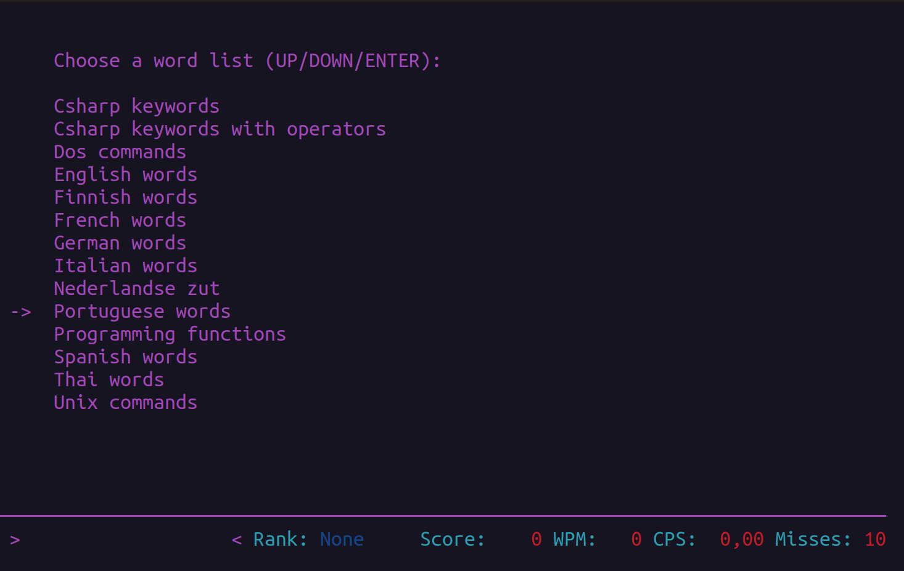

# Lista de palavras em português

Uma vez selecionada a lista de palavras em português, pressione a tecla <kbd>Enter</kbd>.

Palavras começarão a aparecer na tela. Sigas as intruções da [Tela de teste de digiação](teste-digitacao.md).

