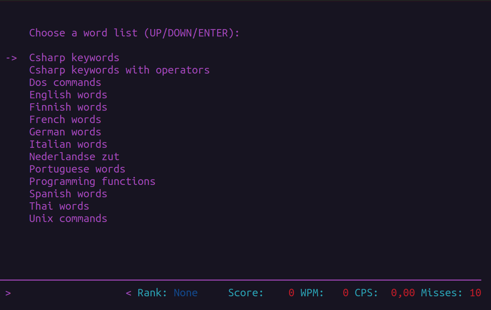

# Lista de palavras

Observe que há uma seta (`->`) indicando a opção selecionada. Use as [teclas direcionais](https://pt.wikipedia.org/wiki/Teclas_direcionais) seta para baixo (&darr;) e seta para cima (&uarr;) para escolher uma das listas.

Por exemplo, se você pressionar nove vezes (9x) a tecla &darr; (Seta para baixo) você observará que a seta (`->`) selecionará *Portuguese words* conforme exibido na tela [Seleção de lista de palavras em português](lista-de-palavras-selecao-portuguese-words.md).

