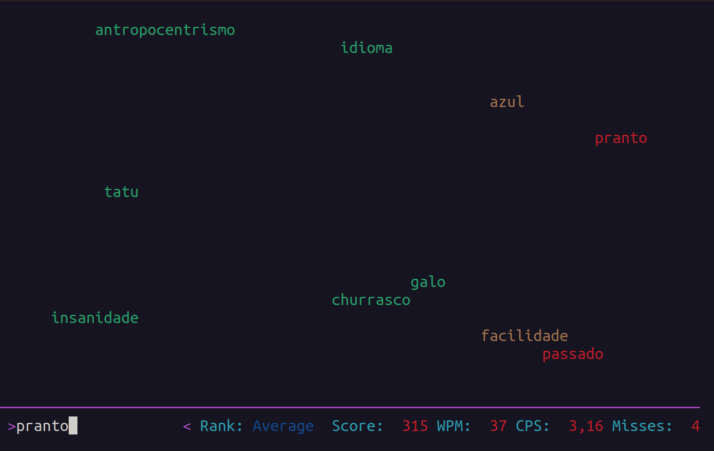

# Teste de digitação

Nesta tela, palavras começarão a aparecer do lado esquerdo e deslizarão para o lado direito da tela. Você deverá digitar qualquer uma das palavras visíveis e pressionar a tecla <kbd>Enter</kbd>. Esta palavra então sumirá da tela. Você perderá ponto se deixar a palavra digitada então desaparecerá. Observe pela imagem que as palavras são coloridas com 3 cores:

1. Verde: Indica que você tem um bom tempo para digitá-la;
2. Marrom: Indica que a palavra está relativamente próxima de desaparer antes de ser digitada; e
3. Vermelho: Indica que a palavra está muito próxima de desaparer antes de ser digitada.

Passado um tempo, aparecerá a mensagem "GAME OVER!" (Fim de jogo, em inglês). Aguarde um pouco que você verá a [tela com sua pontuação](exibicao-de-pontuacao.md).

